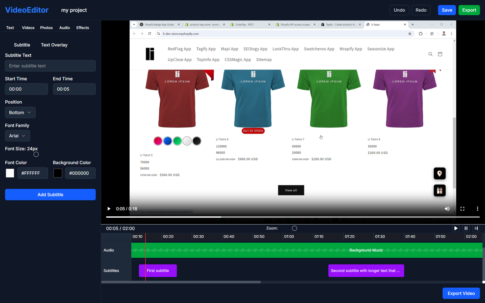

# Video Editor Frontend

A browser-based video editing platform built with Next.js, React, and Tailwind CSS.



## 🌟 Live Demo

Check out the live demo: [Video Editor Web App](https://video-editor-frontend-two.vercel.app)

## 📋 Features

- **Video Upload**: Drag-and-drop interface for uploading video files
- **Timeline Management**: Visual timeline for managing video segments
- **Audio Controls**: Manage original audio and add background music
- **Text & Subtitles**: Add and customize subtitles and text overlays
- **Image Overlays**: Add images with customizable borders, opacity, and position
- **Export Options**: Choose format and quality for your exported video

## 🛠️ Tech Stack

- **Framework**: Next.js 14 with App Router
- **UI Library**: React 18
- **Styling**: Tailwind CSS with ShadCN UI components
- **State Management**: Redux Toolkit
- **Media Player**: React Player
- **File Uploads**: React Dropzone

## 🚀 Getting Started

### Prerequisites

- Node.js 16.8 or later
- npm or yarn

### Installation

1. Clone the repository:
   ```bash
   git clone https://github.com/Hmtgit7/video-editor-frontend.git
   cd video-editor-frontend
   ```

2. Install dependencies:
   ```bash
   npm install
   # or
   yarn install
   ```

3. Run the development server:
   ```bash
   npm run dev
   # or
   yarn dev
   ```

4. Open [http://localhost:3000](http://localhost:3000) in your browser.

## 📁 Project Structure

```
video-editor-frontend/
├── app/                     # Next.js app directory
│   ├── components/          # React components
│   │   ├── audio/           # Audio-related components
│   │   ├── image/           # Image overlay components
│   │   ├── layout/          # Layout components
│   │   ├── preview/         # Video preview components
│   │   ├── text/            # Text and subtitle components
│   │   ├── timeline/        # Timeline components
│   │   └── upload/          # Upload components
│   ├── editor/              # Editor page
│   ├── hooks/               # Custom React hooks
│   ├── lib/                 # Utility functions
│   ├── store/               # Redux store configuration
│   │   └── slices/          # Redux slices
│   ├── globals.css          # Global CSS
│   ├── layout.tsx           # Root layout
│   └── page.tsx             # Home page
├── public/                  # Static assets
└── README.md                # Project documentation
```

## 🔧 Implementation Details

### State Management

The application uses Redux Toolkit to manage state across multiple features:

- `projectSlice`: Project metadata including name and duration
- `videoSlice`: Video uploading and segment management
- `audioSlice`: Audio tracks and volume controls
- `subtitleSlice`: Text overlays and subtitle management
- `timelineSlice`: Timeline navigation and zoom controls
- `exportSlice`: Export settings and status

### Video Editing

All video editing operations happen on the client side:
- Video segments can be viewed on the timeline
- Audio tracks can be adjusted or muted
- Subtitles can be added with precise timing
- Images can be overlaid with custom styling

### UI Components

The application uses ShadCN UI components with Tailwind CSS for styling:
- Sliders for adjusting parameters
- Tabs for organizing different editing features
- Dialogs for configuration screens
- Custom timeline components for video editing

## 🧩 Future Enhancements

- Full drag-and-drop support for rearranging timeline segments
- Real-time preview updates for all changes
- Enhanced UI contrast and accessibility
- Mobile-responsive design
- Server-side video processing integration

## 📄 License

This project is licensed under the MIT License - see the LICENSE file for details.

## 👨‍💻 Author

- Himanshu Mishra

## 🙏 Acknowledgements

- [ShadCN UI](https://ui.shadcn.com/) for the component library
- [Next.js](https://nextjs.org/) team for the React framework
- [Tailwind CSS](https://tailwindcss.com/) for the utility-first CSS framework